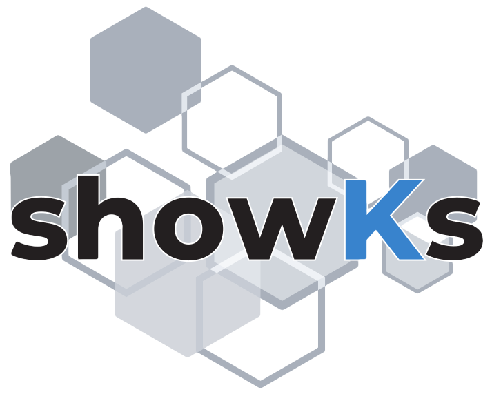

# showKs 2

# ハッシュタグ

showKs 2に関しては `#CNDT2019`と `#showKs` の2つのハッシュタグをつけてのTweetにご協力をお願いします。
たくさんの感想やご意見をお待ちしております。

# チーム紹介

 - [inductor](https://github.com/inductor)
 - [jacopen](https://github.com/jacopen)
 - [jyoshise](https://github.com/jyoshise)
 - [kojiha](https://github.com/kojiha)
 - [makocchi](https://github.com/makocchi-git)
 - [MasayaAoyama](https://github.com/MasayaAoyama)
 - [suzukin](https://github.com/suzukin)
 - [takaishi](https://github.com/takaishi)
 - [tsukaman](https://github.com/tsukaman)

# ライセンス

showKs 2プロジェクトで公開しているものは[showKs Canvasアプリ](https://github.com/containerdaysjp/showks-canvas)のみ[MIT license](https://opensource.org/licenses/MIT)で、残りは全て[Apache 2.0 license](https://www.apache.org/licenses/LICENSE-2.0)です。
