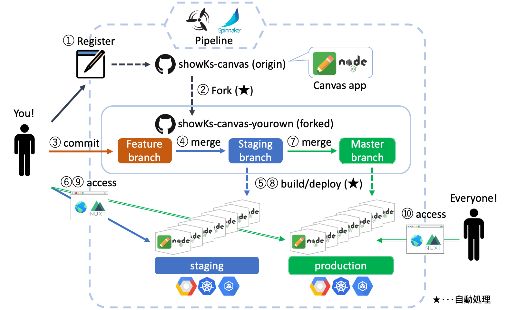
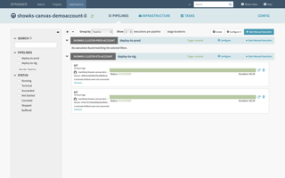

# showKs

# showKsとは ｜ 趣旨

日本最大級のコンテナ関連技術カンファレンスである[JapanContainerDays](https://containerdays.jp/)（通称”JKD”）。

そこにはコンテナ技術に興味がある、あるいはコンテナ技術を愛している、もしくはコンテナ技術ってなんだかよく分からない・・・などなど、様々な人達がたくさん集まります。

　「こんなにも面白い人達が集まるなら、なにか面白いデモができるのでは？」

JKDのスタッフミーティングで出てきたこんな発言をきっかけにスペシャルチームが結成されました。業務でバリバリにコンテナを技術を使っている凄腕エンジニアから、コン
テナ業界を盛り上げているコミュニティの運営者まで、様々な組織の枠組みを超えて結束したまさに”ドリームチーム”が誕生したのです。

　「kubernetes上で実際にアプリが動く環境を皆さんに見てもらいたい！」
　「クラウドネイティブな開発も体験して欲しい！」
　「参加者に持って帰って貰えるようなものにしよう！」
　「アプリに面白さも欲しいよね！」

そんな熱い想いを原動力に連日深夜まで苦労すること数ヶ月、ついにクラウドネイティブな開発を誰にでもお手軽にお試しいただける参加体験型の “showKs（ショーケース）” ができあがりました。

このドリームチームに必要な最後の1ピースは**あなた**です。

是非、ドリームチームに参加してクラウドネイティブな開発を体験してください。

# showKsへの参加方法

showKsへの参加手順の詳細は、[こちら](./howToJoin.md)をご参照ください。

# showKs構成

showKsでは、お絵かきアプリ[showks-canvas](https://github.com/containerdaysjp/showks-canvas)を題材にクラウドネイティブな開発を体験して頂けます。

JKD v18.12におけるshowKs環境は、[Kubernetes](https://kubernetes.io)のクラスターを[Google Cloud Platdform](https://cloud.google.com)上で構成し、[Concourse](https://concourse-ci.org)や[Spinnaker](https://www.spinnaker.io)などのCI/CDツールによりパイプライン管理をすることで、マイクロサービス化されたコンテナアプリをクラウドネイティブに開発できるように構成されています。

また、showksで使用しているコードや設定ファイル、ドキュメント等は[Github](https://github.com/containerdaysjp)上で公開されていますので、どなたでもご自分で同じ環境を作り上げることが可能です。

## showKsの参加および開発体験の流れ

1. 登録フォームからユーザ登録
2. あなた専用のGithubリポジトリが自動作成
3. コードを変更してfeatureブランチへcommit
4. featureブランチからstagingブランチへPullRequest/merge
5. staging環境へアプリコンテナが自動ビルド/デプロイ
6. ブラウザからCanvasアプリへアクセスし動作確認
7. stagingブランチからmasterブランチへPullRequest/merge
8. production環境へアプリコンテナが自動ビルド/デプロイ
9. ブラウザからCanvasアプリへアクセスし動作確認

showKsへの参加手順の詳細は、[こちら](./howToJoin.md)をご参照ください。

## showKs Canvasアプリ

[Node.js](https://nodejs.org/)および[Socket.io](https://socket.io)を用いたお絵かきアプリです。[Socket.IO Collaborative Whiteboard](https://github.com/socketio/socket.io/tree/master/examples/whiteboard)をベースに作成されています。

このアプリケーションには次の機能が実装されています。

- Socket.io経由の複数ブラウザウィンドウ間におけるリアルタイム同期
- ユーザプロフィール（各アカウントおよびコメント）の表示
- 描写カラーの自由な選択
- スマホ/タブレット端末ブラウザからの描写
- 消しゴム機能

showKs Canvasアプリのリポジトリは[こちら](https://github.com/containerdaysjp/showks-canvas)です。showKsへの参加登録が完了すると、このリポジトリからForkされた
あなた専用のリポジトリが自動的に作成されます。

## showKs portal

showKs参加者がそれぞれデプロイしたアプリコンテナから、ユーザプロフィールや画像データなどの情報を集約し、[Nuxt.js](https://nuxtjs.org)を利用して表示するのが"showKs portal"です。このポータル画面から各canvasアプリに移動してお絵かきをすることも可能です。

また、showKsにはstaging（ステージング）とproduction（本番）の2つの環境が用意されてますが、showKs portalは環境毎に独立して用意されています。

 - [staging環境用のポータル](https://portal.stg.showks.containerdays.jp)
 - [production環境用のポータル](https://portal.showks.containerdays.jp)

# 注意事項

showKsの参加に際して、次の事項を遵守頂きますようご協力をお願いします。

- showKsで公開しているコードや情報などを無断で商用利用しないでください。
- Canvasアプリコンテナで公序良俗に反するコメントやイラストなどを表示させないでください。
  - Canvasアプリはインターネットへ公開される点にご留意ください。
  - [JKDのCode of Conduct（行動規範）](https://containerdays.jp/#event-slides)も併せてご一読ください。

# ドキュメント

showKsで利用しているコンポーネントに関する情報は、次のドキュメントリポジトリに随時集約されます。

- [showKs-docs](https://github.com/containerdaysjp/showks-docs)

# 展示ブース

JKD v18.12では、受付隣の1番ブースにおいてshowKsのデモ展示をしています。

展示ブースでは次のようなConcourseやSpinnakerの管理者用ダッシュボードなどをご確認頂けます。

また、showKsに関しての質問も受け付けておりますので、なにかお聞きになりたいことがありましたらブース担当者までお気軽にお声がけください。

# ハッシュタグ

showKsに関しては `#CNDT2019` と `#showKs` の2つのハッシュタグをつけてのTweetにご協力をお願いします。
たくさんの感想やご意見をお待ちしております。

# チーム紹介

 - [Fufuhu](https://github.com/Fufuhu)
 - [inductor](https://github.com/inductor)
 - [jacopen](https://github.com/jacopen)
 - [jyoshise](https://github.com/jyoshise)
 - [kojiha](https://github.com/kojiha)
 - [kyohmizu](https://github.com/kyohmizu)
 - [makocchi](https://github.com/makocchi-git)
 - [MasayaAoyama](https://github.com/MasayaAoyama)
 - [suzukin](https://github.com/suzukin)
 - [takaishi](https://github.com/takaishi)
 - [tsukaman](https://github.com/tsukaman)

# ライセンス

showKsプロジェクトで公開しているものは[showKs Canvasアプリ](https://github.com/containerdaysjp/showks-canvas)のみ[MIT license](https://opensource.org/licenses/MIT)で、残りは全て[Apache 2.0 license](https://www.apache.org/licenses/LICENSE-2.0)です。
