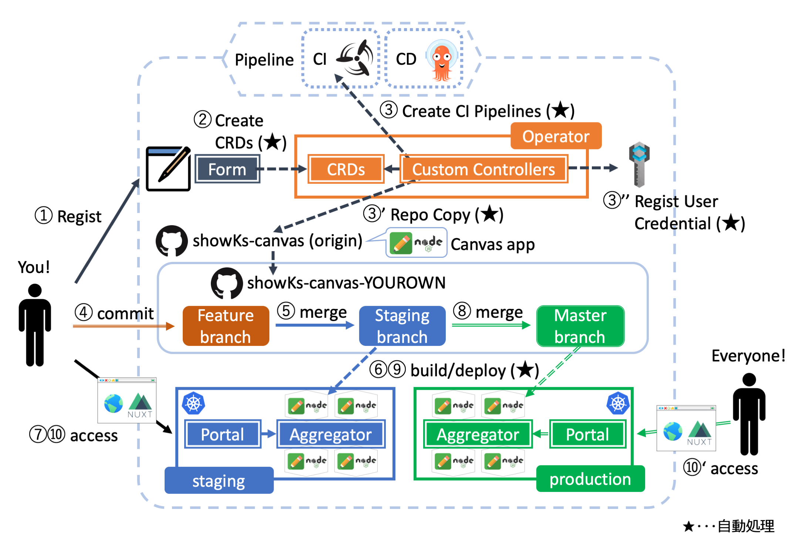
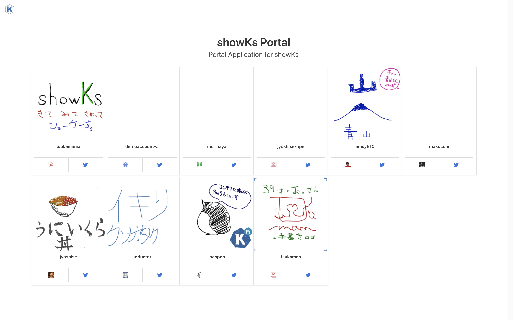
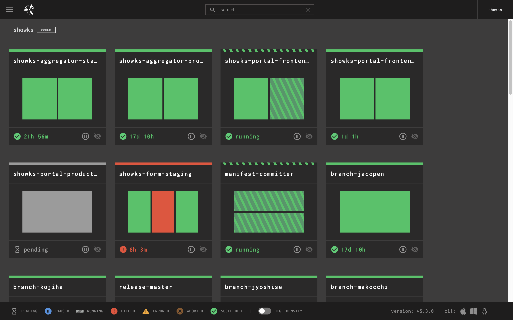
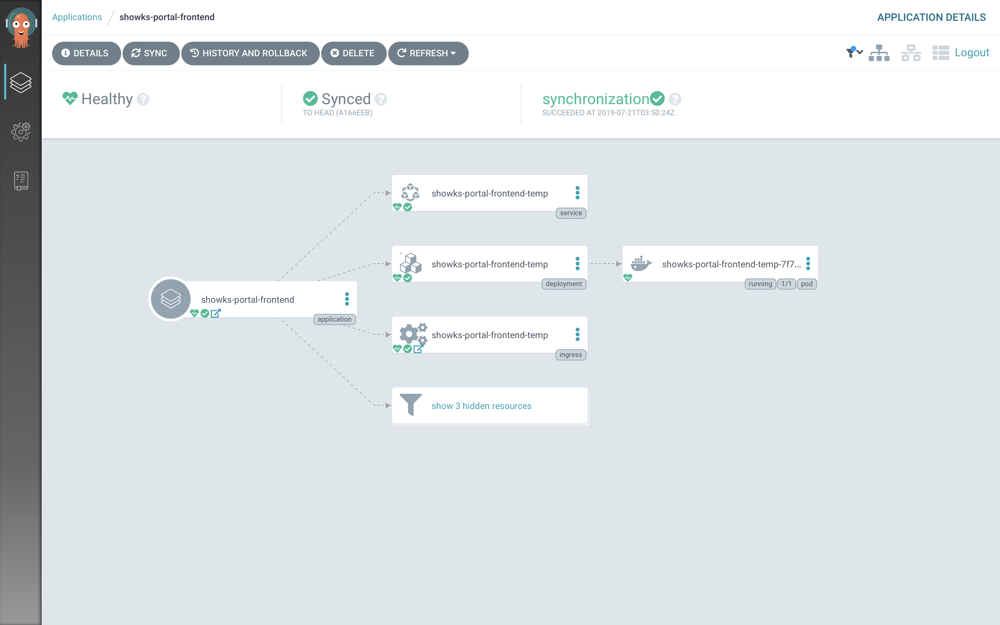
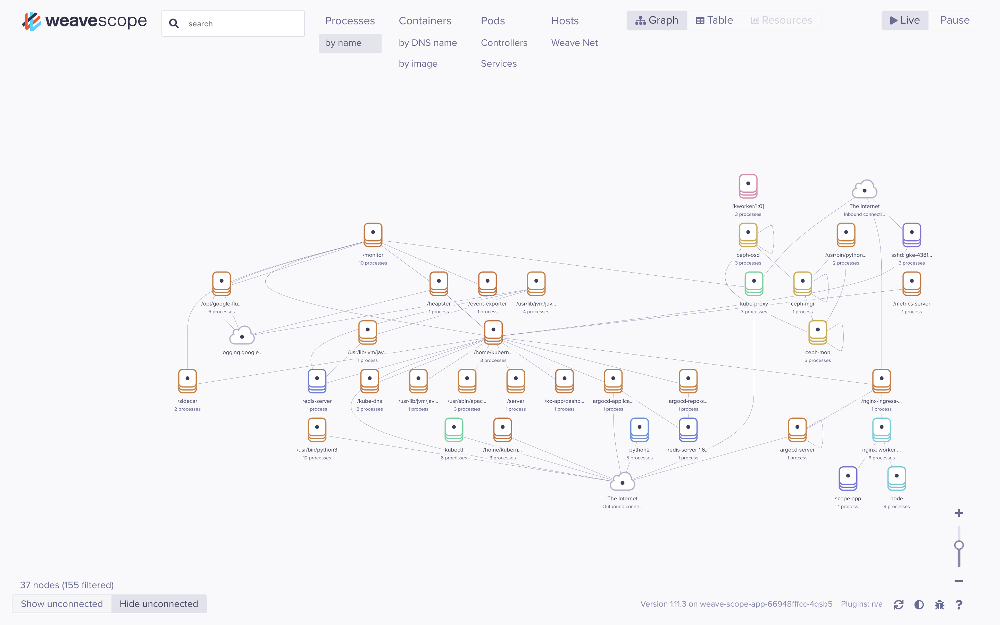

# showKsとは

日本最大級規模のコンテナ関連技術カンファレンスである[JapanContainerDays v18.12](https://containerdays.jp/)（通称”JKD v18.12”）のショーケース企画として、有志のボランティアメンバーによって用意されたのが「showKs（ショーケース）」です。

このshowKsでは、次のコンセプトに基づき企画が準備されました。

  - クラウドネイティブ開発の体験ができる
    - CI/CD パイプライン
    - アプリごとのリポジトリ
    - Pull Requestベースの開発
  - 来場者全員での共同作業
    - マイクロサービスを意識したアーキテクチャ
    - showKs Portalによる全体の俯瞰
    - 他者のキャンバスへのお絵描き追記
  - 全て”お持ち帰り”して貰えるように情報を公開する
    - アプリケーションコード
    - マニフェスト
    - ドキュメント

Cloud Native Days Tokyo 2019（CNDT2019）におけるshowKsでは、上記のコンセプトを踏襲しつつ、更なる進化ポイントを追加しました。

  - よりKubernetes Nativeなアーキテクチャーへ
    - ユーザ登録処理をOparator化
    - CDツールを[Spinnaker](https://www.spinnaker.io/)から[Argo CD](https://argoproj.github.io/argo-cd/)へ変更
    - 永続ストレージをGCSから[Rook](https://rook.io/)に置き換え（一部残留）
  - 認証機構の導入
    - [Keycloak](https://www.keycloak.org)を新規追加
    - ユーザ登録におけるOparator処理により各ユーザ情報を登録
    - showKs Canvas/Portalにおいてどのユーザかを意識した機能の利用が可能に
  - IoT用途に強みのある[k3s](https://k3s.io/)との連携
    - ARMボード上で稼働するk3sクラスターを構築して「showk3s」アプリを稼働
    - showKs canvasで描写されたイラストをRook経由でshowK3sへ受け渡し
    - showK3sでは受け取ったイラストをカメラ画像およびQRコードと合成して表示

前回のshowKsを体験された方にも今回初めて体験するという方にも、「なるほど、こんなことができるのか！」という新たな気づきと体験をお持ち帰り頂けるように、メンバー全員で精一杯に知恵を絞り、また前回以上にハードなスケジュールの中で眠い目をこすりながら開発をすすめました。

あとは、皆様に参加して頂くのを待つばかりです。

登録はとても簡単。「やってみるかな」の気持ちが少しでも湧いたら、クラウドネイティブの世界はすぐそこです。

# showKsへの参加方法

showKsへの参加手順の詳細は、[こちら](./howToJoin.md)をご参照ください。

# 前回のshowKsの詳細

前回のJKD v18.12におけるshowKsについては[こちら](http://showks.containerdays.jp)をご参照ください。

また、この前回のshowKsプロジェクトの軌跡を[技術書典6](https://techbookfest.org/event/tbf06)において「showKsではじめるクラウドネイティブ開発」という1冊の本にまとめました。

なぜこのプロジェクトが企画されたのかや、より詳しい内部のアーキテクチャー実装についての話、またクラウドネイティブを実現するのに苦労したポイントなど、多くのエッセンスを詰め込んでいます。

ご興味のある方は、[こちら](https://booth.pm/ja/items/1318454)より、詳細をご覧ください。

# showk3sとの連携

今回のshowKsでは、IoT分野での利用などを視野にKubernetesの機能を絞り込んで実装した軽量k8sの[k3s](https://k3s.io/)を用いたショーケース企画「showK3s」を平行プロジェクトとして実装・連携しています。

showKsとshowK3sプロジェクト連携についての詳細は、[こちら](./showK3s.md)をご参照ください。

# showKs構成

showKsでは、お絵かきアプリ[showks-canvas](https://github.com/cloudnativedaysjp/showks-canvas)を題材にクラウドネイティブな開発を体験して頂けます。

CNDT 2019におけるshowKs環境は、[Kubernetes](https://kubernetes.io)のクラスターを[Google Cloud Platdform](https://cloud.google.com)上で構成し、[Concourse](https://concourse-ci.org)や[Argo CD](https://argoproj.github.io/argo-cd/)などのCI/CDツールによりパイプライン管理をすることで、マイクロサービス化されたコンテナアプリをクラウドネイティブに開発できるように構成されています。

また、showksで使用しているコードや設定ファイル、ドキュメント等は[Github](https://github.com/cloudnativedaysjp)上で公開されていますので、どなたでもご自分で同じ環境を作り上げることが可能です。

## showKsの参加および開発体験の流れ

1. 登録フォームからユーザ登録
2. formアプリが自動的にCRDを作成
3. Custom Controllerが次の3つの処理を自動実行
  - あなた専用のGithubリポジトリを作成
  - あなた専用のCIパイプラインを作成
  - あなたの認証情報を登録
4. コードを変更してfeatureブランチへcommit
5. featureブランチからstagingブランチへPull Request/merge
6. staging環境へアプリコンテナが自動ビルド/デプロイ
7. ブラウザからPortal/Canvasアプリへアクセスし動作確認
8. stagingブランチからmasterブランチへPull Request/merge
9. production環境へアプリコンテナが自動ビルド/デプロイ
10. ブラウザからPortal/Canvasアプリへアクセスし動作確認

showKsへの参加手順の詳細は、[こちら](./howToJoin.md)をご参照ください。

## showKs Canvasアプリ

[Node.js](https://nodejs.org/)および[Socket.io](https://socket.io)を用いたお絵かきアプリです。[Socket.IO Collaborative Whiteboard](https://github.com/socketio/socket.io/tree/master/examples/whiteboard)をベースに作成されています。

このアプリケーションには次の機能が実装されています。

- Socket.io経由の複数ブラウザウィンドウ間におけるリアルタイム同期
- ユーザプロフィール（各アカウントおよびコメント）の表示
- 描写カラーの自由な選択
- スマホ/タブレット端末ブラウザからの描写
- 消しゴム機能

showKs Canvasアプリのリポジトリは[こちら](https://github.com/cloudnativedaysjp/showks-canvas)です。showKsへの参加登録が完了すると、このリポジトリの内容をコピーした、あなた専用のリポジトリが自動的に作成されます。

## showKs portal

showKs参加者がそれぞれデプロイしたアプリコンテナから、ユーザプロフィールや画像データなどの情報を集約し、[Nuxt.js](https://nuxtjs.org)を利用して表示するのが"showKs portal"です。このポータル画面から各canvasアプリに移動してお絵かきをすることも可能です。

また、showKsにはstaging（ステージング）とproduction（本番）の2つの環境が用意されてますが、showKs portalは環境毎に独立して用意されています。

 - [staging環境用のポータル](https://portal.stg.showks.cloudnativedays.jp)
 - [production環境用のポータル](https://portal.showks.cloudnativedays.jp)

# 注意事項

showKsの参加に際して、次の事項を遵守頂きますようご協力をお願いします。

- showKsで公開しているコードや情報などを無断で商用利用しないでください。
- Canvasアプリコンテナで公序良俗に反するコメントやイラストなどを表示させないでください。
  - Canvasアプリはインターネットへ公開される点にご留意ください。
  - [CNDTのCode of Conduct（行動規範）](https://cloudnativedays.jp/cndt2019/#CoC)も併せてご一読ください。

# ドキュメント

showKsで利用しているコンポーネントに関する情報は、次のドキュメントリポジトリに随時集約されます。

- [showKs-docs](https://github.com/cloudnativedaysjp/showks-docs)

# 展示ブース

展示会場奥側の書籍販売ブース横にて、showKsおよびshowK3sのブース展示をしています。
展示ブースでは、showKs Canvas/PortalやshowK3sの画面、さらには各種管理者用ダッシュボードなどをご確認頂けます。

また、showKs/showK3sに関しての質問も受け付けておりますので、何かお聞きになりたいことがありましたらブース担当者までお気軽にお声がけください。

# ハッシュタグ

showKsに関しては `#CNDT2019` と `#showKs` の2つのハッシュタグをつけてのTweetにご協力をお願いします。
たくさんの感想やご意見をお待ちしております。

# チーム紹介

 - [Fufuhu](https://github.com/Fufuhu)
 - [inductor](https://github.com/inductor)
 - [jacopen](https://github.com/jacopen)
 - [jyoshise](https://github.com/jyoshise)
 - [kojiha](https://github.com/kojiha)
 - [kyohmizu](https://github.com/kyohmizu)
 - [makocchi](https://github.com/makocchi-git)
 - [MasayaAoyama](https://github.com/MasayaAoyama)
 - [suzukin](https://github.com/suzukin)
 - [takaishi](https://github.com/takaishi)
 - [tsukaman](https://github.com/tsukaman)

# ライセンス

showKsプロジェクトで公開しているものは[showKs Canvasアプリ](https://github.com/containerdaysjp/showks-canvas)のみ[MIT license](https://opensource.org/licenses/MIT)で、残りは全て[Apache 2.0 license](https://www.apache.org/licenses/LICENSE-2.0)です。

