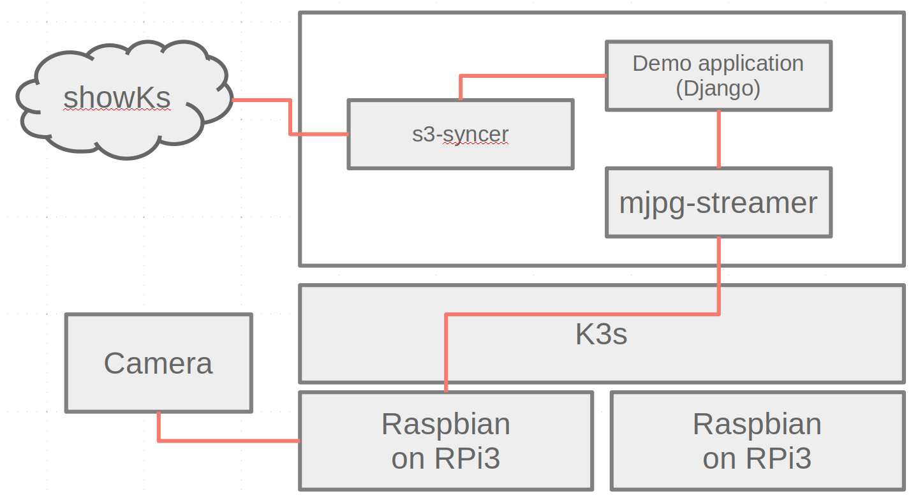
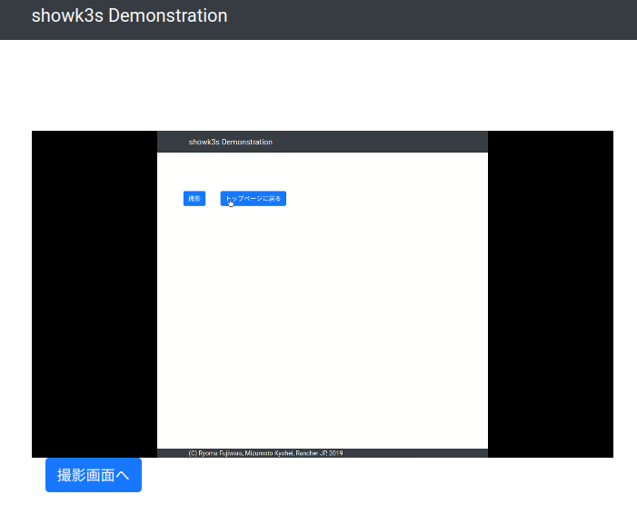
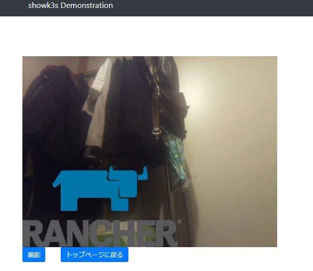
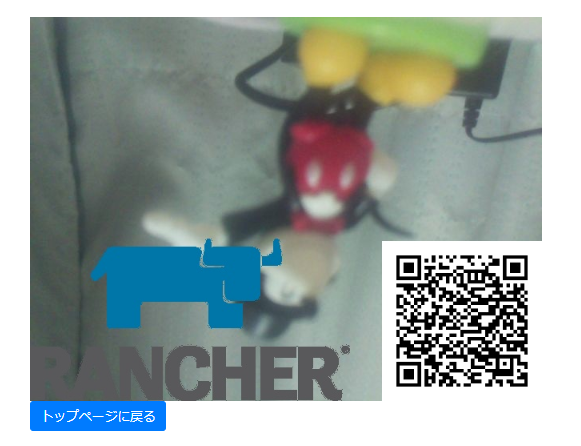

# showK3s

# showK3sとは ｜ 趣旨

# showK3s構成

showK3sでは、showKsと連動した画像作成を行います。

showKsで作成された画像をサーバーから取得し、カメラで撮影した映像と重ね合わせて表示します。

撮影機能で映像のスナップショットを作成・保存し、保存先URLをQLコードとして画像に付与します。

# 展示ブース

CNDT 2019では、showK3sのデモ展示をしています。

展示ブースではshowKsと連動した画像作成をタッチパネルでご体験頂けます。

作成した画像をその場でお持ち帰り頂くことも可能です。

また、showK3sに関しての質問も受け付けておりますので、なにかお聞きになりたいことがありましたらブース担当者までお気軽にお声がけください。

## 体験方法

showK3sアプリのトップページです。

「撮影開始」ボタンをタップしてください。

カメラ映像がshowKsの画像と重ね合わせて表示されます。

「撮影」ボタンをタップしてください。

スナップショットが作成されました。

QLコードを読み取ることで画像を保存できます。

# ハッシュタグ

showKsに関しては `#CNDT2019` と `#showK3s` の2つのハッシュタグをつけてのTweetにご協力をお願いします。
たくさんの感想やご意見をお待ちしております。

# チーム紹介

 - [Fufuhu](https://github.com/Fufuhu)
 - [jacopen](https://github.com/jacopen)
 - [kyohmizu](https://github.com/kyohmizu)
 - [tsukaman](https://github.com/tsukaman)

# ライセンス
